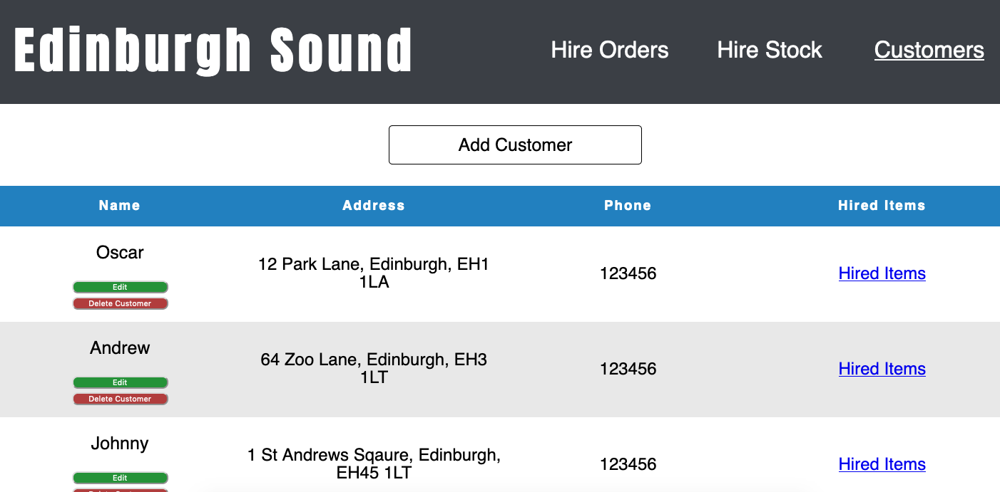
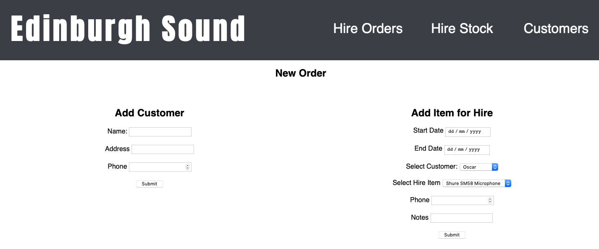

# Edinburgh Sound Ruby Project 

This is my first CodeClan project which I created on my own in Week 5. Below are some images of the app.  

To use the app you can visit the link provided which will take you to heroku.

This is the form to create a hire order.

As can be seen this is a stock mangament software to be used by staff members of Edinburgh Sound. 

## Tech Stack

 - Ruby
 - Express Server
 - Sinatra 
 

## Setting up this app locally 

- Clone this repo from github.

The first 3 commands can be done in any file as ruby gems and database creation are global. 

- In terminal: 'gem install sinatra'

- In terminal: 'gem install postgres'

- In terminal: 'psql edinburghsound'

- Now make sure you are in the root directory of the project

- In terminal: 'ruby db/seeds.rb'

- In terminal: 'ruby controller.rb'

- The app should now be running locally!
